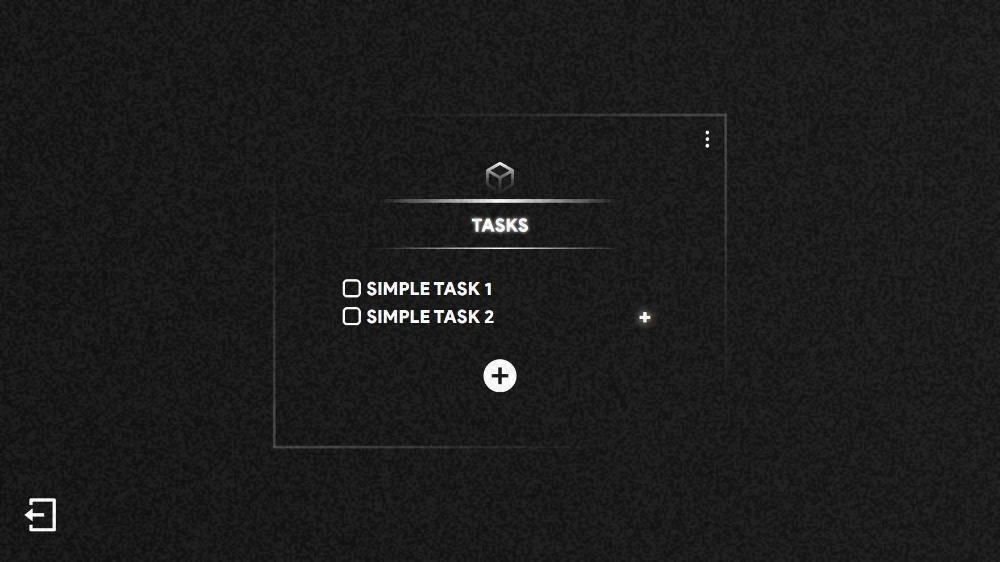
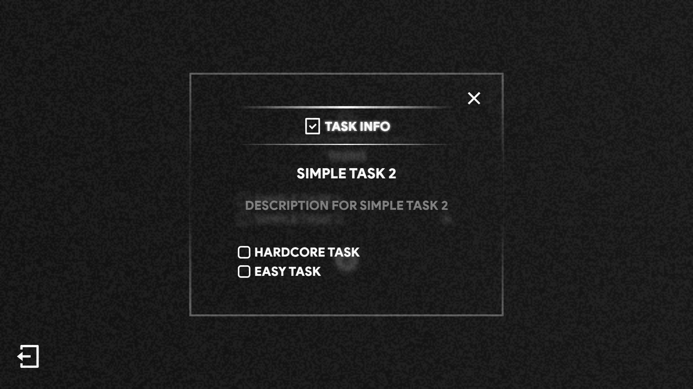
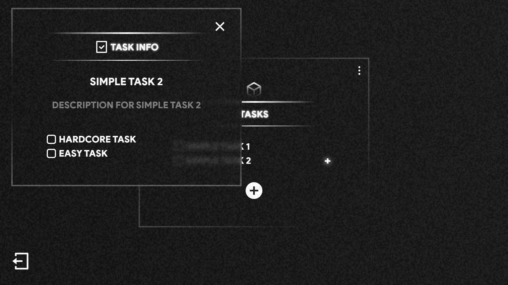
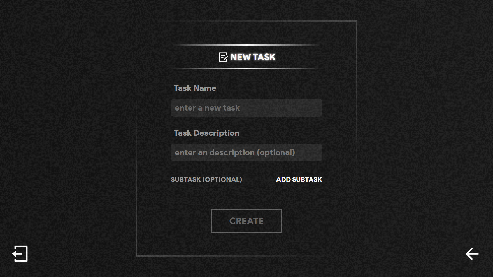
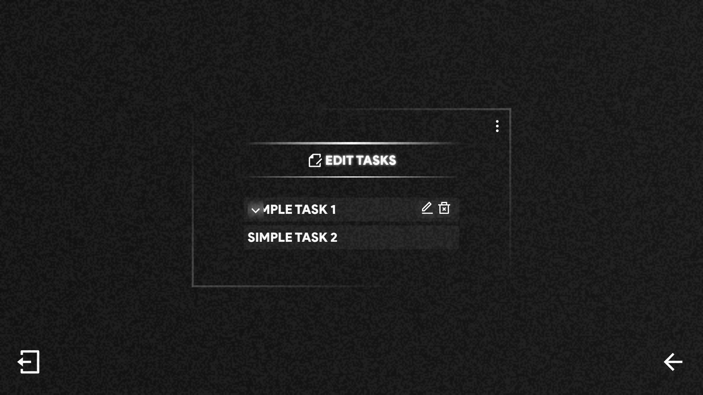

<h2 align="center">
   Tasks Demo
</h2>

  <a href="#-aviso">Aviso</a>&nbsp;&nbsp;&nbsp;|&nbsp;&nbsp;&nbsp;
  <a href="#-projeto">Projeto</a>&nbsp;&nbsp;&nbsp;|&nbsp;&nbsp;&nbsp;
  <a href="#-tecnologias">Tecnologias</a>&nbsp;&nbsp;&nbsp;|&nbsp;&nbsp;&nbsp;
  <a href="#-design">Desgin</a>&nbsp;&nbsp;&nbsp;|&nbsp;&nbsp;&nbsp;
  <a href="#-demo">Demo</a>&nbsp;&nbsp;&nbsp;|&nbsp;&nbsp;&nbsp;
  <a href="#-licença">Licença</a>

## 📑 Aviso 
Este pequeno projeto é apenas uma pequena demo e teste, para um outro projeto que ando trabalhando, por esse mesmo motivo, não irei instruir como rodar o mesmo, outro motivo tambem seria que a API usada nele ainda está sendo desenvolvida. 

## 💻 Projeto

Este projeto foi pensado e construído idealizando uma lista de tarefas, onde a tarefa nessa lista poderia ter um nome, uma descrição e sub tarefa(s), o projeto contém as seguintes funcionalidades: 

- [x] Registrar uma nova tarefa, sendo descrição e sub tarefa(s) opcionais.
- [x] Editar dados de uma tarefa já criada.
- [x] Marca a tarefa como finalizada.
- [x] Deletar uma tarefa especifica ou todas.
- [x] Ver dados da tarefa ao clicar nela por meio de um "modal".

**extra:** 

Toda parte de Autenticação e Validação de dados foi feito usando outro projeto que criei, sendo esse aqui: [login-and-register](https://github.com/Pol4rLun4r/login-and-register) 

### 📸 Imagens

**Home**

**Task Info**

**New Task**

**Edit Tasks**

## 🚀 Tecnologias

Esse projeto foi desenvolvido com as seguintes tecnologias:

- [ReactJS](https://pt-br.reactjs.org)
- [Axios](https://axios-http.com/ptbr/)
- [ReactRouter](https://reactrouter.com)
- [TypewriterJS](https://github.com/tameemsafi/typewriterjs#readme)
- [FramerMotion](https://www.framer.com/motion/)
- [GlitchedWriter](https://github.com/thetarnav/glitched-writer)
- [ReactHookForm](https://react-hook-form.com)
- [ReactQuery](https://tanstack.com/query/v3/)
- [StyledComponents](https://styled-components.com/docs)
- [Zod](https://zod.dev)
- [Lodash](https://lodash.com/)
- [ReactDraggable](https://www.npmjs.com/package/react-draggable)
- [ReactMedia](https://www.npmjs.com/package/react-media)
- [ReactTextAreaAutoSize](https://www.npmjs.com/package/react-textarea-autosize)
- [VitePluginVSGR](https://www.npmjs.com/package/vite-plugin-svgr)

## 🔖 Design

O design desse projeto foi feito com base em uma arte que fiz no figma: [ver design](https://www.figma.com/file/scAVrgyOVYQMUyc8ZIs8eT/System?type=design&node-id=0%3A1&t=ZGUxplnyg5qdHscI-1)

## 🎮 Demo 

Caso tenha ficado interresado você pode acessar a versão demo desse projeto [clicando aqui.](https://tasks-demo.netlify.app/login)

### contas para acessar o site:
- **conta do admin:**  
**_username:_** admin  
**_password:_** admin

- **conta de usuário:**  
**_username:_** nomade  
**_password:_** nomade

> você é livre para criar outra conta se quiser

## 📝 Licença

Esse projeto está sob a licença MIT. Veja o arquivo [LICENSE](LICENSE) para mais detalhes.
